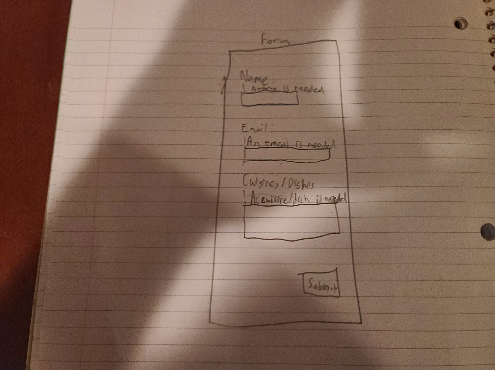

# Project 3: Design Journey

**For milestones, complete only the sections that are labeled with that milestone.**

Be clear and concise in your writing. Bullets points are encouraged.

**Everything, including images, must be visible in Markdown Preview.** If it's not visible in Markdown Preview, then we won't grade it. We won't give you partial credit either.

**Make the case for your decisions using concepts from class, as well as other design principles, theories, examples, and cases from outside of class.**

You can use bullet points and lists, or full paragraphs, or a combination, whichever is appropriate. The writing should be solid draft quality but doesn't have to be fancy.

## Project 1 or Project 2
> Which project will you add a form to?

Project 2


## Audience (Milestone 1)
> Who is your site's target audience? This should be the original audience from Project 1 or Project 2. You may adjust the audience if necessary. Just make sure you explain your rationale for doing so here.

My target audience are Cornell students in their senior year and are leaving afterwards.


## Audience's Needs (Milestone 1)
> List the audience's needs that you identified in Project 1 or 2. Just list each need. No need to include the "Design Ideas and Choices", etc. You may adjust the needs if necessary. However, any changes you make to the needs for this project should be clearly identified and justified.

- Food
- Schedule
- Costs
- Culture


## HTML Form + User Needs Brainstorming (Milestone 1)
> Using the audience needs you identified, brainstorm possible options for an HTML form for the site. List each idea and provide a brief rationale for how the HTML form addresses that need.

- Suggestion form for events / Provide suggestions for a new event that embodies the culture of Ithaca
- Request for foods / Provide suggestions for different types of cuisines at the festival


## HTML Form Proposal & Rationale (Milestone 1)
> Make a decision about your site's form. Describe the purpose of your proposed form for your Project 1 or 2 site. Provide a brief rationale explaining how your proposed form meets the needs of your site's audience.
> Note: If your form is a contact form, we expect to see a thorough justification explaining how a contact form addresses the user's _actual_ needs. In your justification explain how a contact form better suits the needs of your user compared to the alternatives (e.g. sending you an email using your email address).

Form Proposal: The form asks the user what kind of foods they would like at the festival. A person who enters an item is also put in for a chance to win a free meal.

User Needs Rational: The audience has a need to know what food is available at the festival. If they would like a certain cuisine or dish to be served, they can request it and sastify their need for the food they would like. They also have the opportunity to win a free meal which is important to the need of costs.


## Form User Data (Milestone 1)
> Think through and plan the data you need to collect from the users. Do you need their name? Email address? etc.

- Name
- Phone #
- Email Address
- Cuisines/Dishes (Updated to food)


## Form Components & Validation Criteria (Milestone 1)
> For each piece of data you plan to collect from the users, identify an appropriate HTML component to collect that data and decide the validation criteria (e.g. whether this data is _required_). Briefly explain your reasoning for the component choice and the validation criteria.


- Name (required): text field; `<input type="text">`
- Required
- A name is necessary for the selection of a winner of the meal. A text input type allows for any name to be entered.

- Email (required): text field(email); `<input type="email">`
- Required
- An email is required to communicate to the winner of the meal. Becuase the input is an email, the email input type is used.

(Update Final Submission)

- Phone # (required): text field(tel); `<input type="tel">`
- Required / minlength="10" / pattern="[0-9]+"
- A phone number is required to communicate to the winner of the meal. Becuase the input is a phone number, the telephone input was added. There is also an added requirment of at least 10 digits so that the festival can have the full phone number of the winner and not worry if they didn't add an area code. Also, the input is limited to only digits since the input is for a phone number.

- Food: textarea; `<textarea>`
- Required
- A food item/cuisine is required because the vendors need to know what kind of food they should make. A text input type allows for any cuisine/food dish to be entered.

(Update Final Submission)

- Submit: button; `<input type="submit">`
- Required to submit form
- A submit button is needed in order to submit the form.


## Form Location (Milestone 1)
> Which HTML file will you place your form?

(recommend.html)

> Sketch the location of the form in that page. This sketch need not be fancy. You don't need to provide many details of the page or form. Just plan the location of the form on the page and communicate that to us. You can literally have a box that says "FORM HERE."

**Desktop Location**

The form will be placed in the middle of the page since it is the central part of the new page.


**Mobile Location**


## Form Design (Milestone 1)
> Include sketches on your form below. Include sketches of your **mobile and desktop** versions without corrective feedback. Show us the evolution of your design and the alternatives you considered.

**Desktop Sketches**

I initially wanted to have the Cuisines/Dishes on top because it is the central part of the form.


I soon decided to have it on the bottom of the form because I don't want the user to possibly forget about the other information that is needed


Update (Final Submission)

After learning that there needs to be an additional component needed for the form, the phone # input was added to the form. At first the idea of adding the phone number before the email address was designed. Also, the design principles such as alignment and size are commented on in this sketch. Also, the cuisines/dishes label was changed to food. The top of the form shows the * means required. There are also comments below the phone number and food inputs to let the user know how to formulate their answers.


Then the idea of adding the phone number after the email address was soon created. After deciding between the two, the design with the phone number on top of the email address was the one to be finalized because it better fit with the scanning principle of top-left to bottom-right since the email field is longer than the phone number input.


**Mobile Sketches**

I followed a similar approach to the desktop vesion when creating the mobile form.


However, I came across the issue that the lack of horizontal space isn't conducive to having the label and the input field on the same horizontal level. I then decided to put the labels on top of the input fields to account for the lack of horizontal space.


(Final submission update)

Upon making the changes to the desktop version for the phone number and adding the comments below the phone number and food inputs, the mobile version was created with the same principles as the previous mobile version. The alignment and scanning principle is outlined on the sketch.


Update (Final Submission)

The mobile design has been updated for the phone number field and describes the design principles that are active.

## Form Feedback Design (Milestone 1)
> Include sketches of your **mobile and desktop** with _corrective feedback_. Show us the evolution of your design and the alternatives you considered.

**Desktop Feedback**

The feedback is placed on top of the input so that it can be visible for the user.


Update (Final Submission)

There is now feedback for phone number. Also, a red border was added for the fields when validation fails. In attempty to prevent the user from perceiving mildly aggresive feedback, the exclamation points in the feedback were changed to an asterisk. Also, the feedback is now bold and larger to grab the user's attention.


**Mobile Feedback**

The mobile feedback is placed directly above the field so that the user can quickly find it next to the input field. The fields, labels, and feedback are all left-aligned.



Update (Final Submission)

The feedback was moved to above the label since it would make more sense to keep the field and labels next to each other. It also makes it easier to implement without changing a lot of the structure.


## Form Implementation Planning (Milestone 1)
> What submission method will your form use? GET or POST. Explain your reasoning.

I will be using POST since there is a lot information in the form that will be sent to the server. Also, privacy is a concern for the name, email, and phone number.

> For your site's `<form>` element, plan all HTML attributes that you will need and their values. Hint: action=, method=, novalidate

- method="post"
- action="https://www.cs.cornell.edu/courses/cs1300/2020fa/submit.php"
- novalidate


## Additional Information (Milestone 1)
> (optional) Include any additional information, justifications, or comments we should be aware of.

Nothing to add


## Plan Validation Pseudocode (Final Submission)
> Write your form validation pseudocode here.

```
When the submit button is pressed:

  If the name data is valid:
    hide name feedback
    turn off input field changes
  Else:
    show name feedback
    turn on input field changes

  If the phone number data is valid:
    hide phone number feedback
    turn off input field changes
  Else:
    show phone number feedback
    turn on input field changes

  If the email criteria is valid:
    hide email feedback
    turn off input field changes
  Else:
    show email feedback
    turn on input field changes

  If the food criteria is valid:
    hide food feedback
    turn off input field changes
  Else:
    show food feedback
    turn on input field changes

  If the form is valid:
    submit the form
  Else:
    don't submit the form
```


## Additional Design Justifications (Final Submission)
> If you feel like you haven’t fully explained your design choices in the final submission, or you want to explain some functions in your site (e.g., if you feel like you make a special design choice which might not meet the final requirement), you can use the additional design justifications to justify your design choices. Remember, this is place for you to justify your design choices which you haven’t covered in the design journey. Use it wisely. However, you don’t need to fill out this section if you think all design choices have been well explained in the final submission design journey.

Nothing to add.


## Self-Reflection (Final Submission)
> This was the first project in this class where you coded some JavaScript. What did you learn from this experience?

While I have had experience with programming, I relearned that using a new language and more specifically different medium (web programming) takes time to get right. I had encountered a number of small syntactical errors that are relatively easy fixes and I wasn't aware what to look for. Now, I gained some insight on what I should look for if I encounter errors.


> Reflect on how HTML, CSS, and JavaScript together support client-side interactivity. If it's helpful, you can describe your mental model of client-side interactivity or explain how the general idea of showing and hiding content can be used to implement other forms of client-side interactivity beyond form validation and feedback.

HTML holds the actual content of the site. CSS will dictate how the client will see the content with JavaScript driving the changes in CSS based on specific actions. While this is effective for form validation and feedback, there are many other ways that the combination of HTML, CSS, and JavaScript can support client-side interactivity. A couple examples of this could be an interactive menu for a restaurant that display different sections based on the button that was pressed, or a photo gallerly can be made to enlarge images when clicked.


> Take some time here to reflect on how much you've learned since you started this class. It's often easy to ignore our own progress. Take a moment and think about your accomplishments in this class. Hopefully you'll recognize that you've accomplished a lot and that you should be very proud of those accomplishments!

I learned quite a bit. This is actually my third iteration of taking this class because of the two leaves of absences I took. Honestly, I'm glad that I have completed the class and I learned more than I did last time because I was in this class for longer. Honestly, this year's project 1 and 2 were much better than last year's in terms of design and functionality. The one part that I had yet to experience up until now was the interactivity part of the class, and I learned quite a lot about how to implement different types of interactivity. In fact, I want to go back to my project 1 (my personal website) and add some interactivity to it. I learned a lot through this class, and I certainly will take some of these skills to other projects and INFO 2300.
